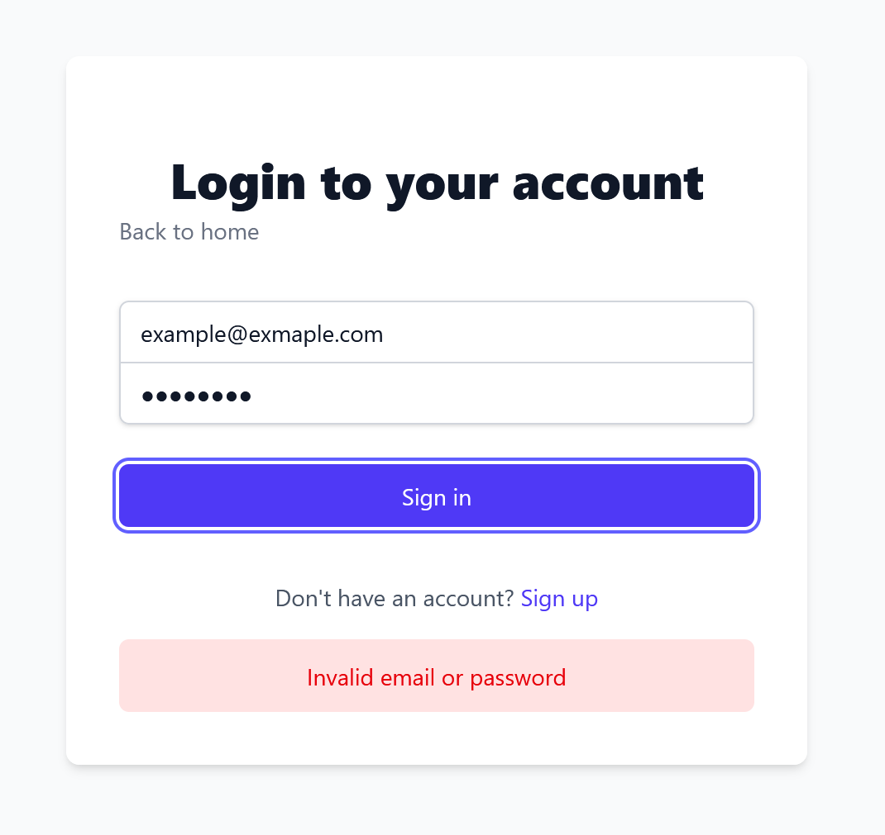

# HONO - VITE - AUTH SAMPLE APP

#### Description

This is a sample app that demonstrates how to use Hono with Vite.
Backend is fully tested with vitest.
Frontend is built with Vite and React.

I tried to keep the code as clean as possible and easy to understand.

For a real application, i would swap out the frontend for a more robust framework like ReactRouter V7 or NextJS. But for demonstration purposes, this is a good starting point.

### Features

- [x] Authentication
- [x] Email Verification
- [x] Mail Service (Interface with adapter pattern, for now just console.log)

### Images




#### Run tests

```bash
pnpm test
```

Coverage:

```bash
pnpm test:coverage
```

#### How to run

1. Clone the repository
2. Run `pnpm install`
3. Setup .env file in /apps/backend and /packages/prisma
4. Run `pnpm dev`
